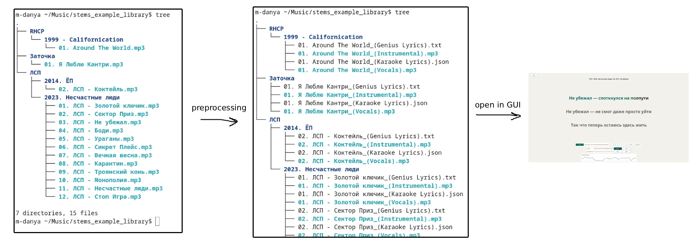

# AI Karaoke

**Ролик на русском про этот проект: [https://youtu.be/-nD3SonIOUs](https://youtu.be/-nD3SonIOUs)**


A desktop karaoke workstation for turning **plain MP3 files** into a playable
two-stem karaoke library.

## What This Project Does

- Runs a full preprocessing pipeline from regular MP3 files.
- Plays paired stem tracks (Vocals & Instrumental tracks) with independent volume control.
- **Automatically fetches lyrics** from Genius.com
- Provides awesome karaoke playback.



## Processing pipeline

Given an MP3 file, the processing pipeline does this in order:

1. Separation: splits the source into `_(Vocals).mp3` and `_(Instrumental).mp3`.
2. Genius lyrics fetch: downloads missing lyrics and writes `_(Genius Lyrics).txt`.
3. Forced alignment: aligns words to vocal audio and writes `_(Karaoke
   Lyrics).json` with per-word timestamps.

## How to properly place mp3s in the library directory

`Process` scans the selected library path **recursively** and takes every `.mp3`
file as source, except already processed files.

So all these source layouts are valid:

- `<library_dir>/Artist/Song.mp3`
- `<library_dir>/Artist/Album/Song.mp3` (the album name is ignored when fetching lyrics from Genius)
- `<library_dir>/Song.mp3` (BUT it will most likely not work when fetching lyrics from Genius!)

## Requirements

- `uv`
- `ffmpeg` available in `PATH`
- (very desirable) a GPU (for processing pipeline)

## Quick Start (Recommended)

```bash
./install.sh
```

`install.sh` automatically:
- asks for Genius Client Access Token interactively
- shows where to get it: https://genius.com/api-clients
- creates/updates `.env` with `GENIUS_ACCESS_TOKEN=...`
- installs/upgrades the app executable with `uv tool install --force -e .`
- installs the icon to `~/.local/share/icons/hicolor/scalable/apps/ai-karaoke.png`
- generates `~/.local/share/applications/ai-karaoke.desktop` with the correct `Exec=...` path
- updates icon cache / desktop database when corresponding tools are available

## Manual Setup (If You Need It)

Create `.env` in the project root with a Genius token:

```bash
GENIUS_ACCESS_TOKEN=your_token_here
```

You can get your Client Access Token for free at:
https://genius.com/api-clients

If you already have your karaoke library processed and want to run only player
features (for example on a laptop), install without the default music-processing
dependency group:

```bash
uv sync --no-default-groups
```

Then run the app manually:

```bash
uv run ai-karaoke
```

## Storage

- App config: `~/.config/ai_karaoke.json`
- Playlists/history: `.ai_karaoke_playlists.json` inside the current library folder

## Pipeline Technical Notes (Stage by Stage)

**1) Stem separation (must run first).** The separation stage lives in `src/ai_karaoke/music_processing/separation.py` (`separate_mp3s`) and is exposed via `ai-karaoke-process` (`ai_karaoke.music_processing.main:main`). It uses `audio-separator[gpu]` and loads the checkpoint `model_bs_roformer_ep_317_sdr_12.9755.ckpt` through `audio_separator.separator.Separator`. The script runs MDX separation with explicit params (`hop_length=1024`, `segment_size=256`, `overlap=0.2`, `batch_size=1`, `enable_denoise=False`), writes `_(Vocals).mp3` + `_(Instrumental).mp3`, and deletes the source MP3 only if both output stems were successfully produced.

**2) Lyrics fetch from Genius.** The second stage is `fetch_missing_genius_lyrics(...)` in `src/ai_karaoke/music_processing/genius_fetch.py`, based on the `lyricsgenius` client and a `GENIUS_ACCESS_TOKEN` from environment or `.env`. For each vocals stem it infers `artist + song` from the file path, then performs multi-attempt query normalization (strip bracket suffixes, remove `feat.`, normalize punctuation) to improve hit rate. Successful fetches are saved as `_(Genius Lyrics).txt`; very short or low-quality results (fewer than 5 usable lines) create an empty marker file intentionally, so failed lookups are not retried forever.

**3) Forced alignment (word timestamps).** The final stage is `process_genius_lyrics(...)` from `src/ai_karaoke/music_processing/alignment_pipeline.py`, which calls `LyricsAligner` in `src/ai_karaoke/music_processing/lyrics_align.py`. Alignment is built on `ctc-forced-aligner` from `https://github.com/MahmoudAshraf97/ctc-forced-aligner.git` and uses model `MahmoudAshraf/mms-300m-1130-forced-aligner` by default. The code generates acoustic emissions, runs CTC forced alignment, then post-processes spans into per-word timings; it auto-detects Cyrillic and switches to `rus` + romanization when needed. Output is written as `_(Karaoke Lyrics).json` with per-line and per-word `start_ts`/`end_ts` fields.

## Shout-out to these repositories!

- https://github.com/nomadkaraoke/python-audio-separator
- https://github.com/johnwmillr/LyricsGenius
- https://github.com/MahmoudAshraf97/ctc-forced-aligner

## Vibe-coding notice

This is a hobby project. All code in this repository was vibe-coded using `gpt-5.2-codex` in a week or so.

## Server mode and Android

Install [AI Karaoke.apk](./AI%20Karaoke.apk) on an Android phone or tablet (Android
7.0/API 24 or newer). The app contains its own interface and audio player.

1. Open the desktop app, choose your library, and click **Server mode OFF**. The
   button changes to **Server mode ON**; HTTP and UDP discovery listen on
   **0.0.0.0:9595**. Server mode starts disabled on every desktop launch.
2. Connect the computer and Android device to the same LAN/Wi-Fi. Open the Android
   app: it automatically searches for servers. Tap a result, or enter the
   computer's IP/hostname manually. The port is always 9595.
3. Choose a song and tap **Начать караоке**. Connect your Bluetooth speaker to
   **Android**: both stems are downloaded and mixed on that device. The computer
   serves files and performs processing/export jobs; mobile playback does not
   start or control desktop audio.
4. Click **Server mode ON** again to stop serving. Closing the desktop also stops
   the server. A song already downloaded to Android can continue playing.

Multiple devices can play different songs, positions, mixes and loops at the same
time. Playback, autoplay, lyrics settings, playlists and mobile history belong to
each client. Existing desktop playlists are copied on the first connection to a
library; subsequent mobile edits are local. Missing playlist tracks remain
visible in red and cannot play. Mobile history is updated when karaoke starts.

The mobile interface includes search, folder/playlist/history filters, separate
0–200% vocals/instrumental controls, mute/reset, pause, seeking, autoplay, timed
word highlighting, vocal waveform, A–B loops, line/font settings, start countdown,
finish celebration, and lyrics search. Tap a lyric line to seek to it. Settings
include a lyrics offset for Bluetooth latency (negative values delay highlighting).
It also supports importing original MP3s, processing with worker/Genius-delay and
`--only-align` options, process logs/cancellation, transposed copies, deletion,
MP3 mix exports, and MP4 karaoke exports with dimensions/FPS. Exports are downloaded
to Android's Downloads folder. MP4 uses the instrumental track, as on desktop.

The server shares the library selected **when enabled**. Changing the desktop
library does not interrupt clients; toggle server mode off/on to share the new
folder. Import, delete, transpose and processing change that shared library;
refresh the desktop/mobile library to see these changes.

There is **no authentication or encryption**. Use a trusted LAN and do not expose
9595 to the Internet. Allow TCP 9595 and UDP 9595 in the computer's firewall.
Discovery broadcasts on connected IPv4 interfaces and also probes their local
/24 ranges when UDP is filtered. On larger/routed networks, broadcast discovery
or manual entry works; Wi-Fi client isolation can prevent any connection.

Audio is decoded in device memory before playback; long tracks need more RAM.
Keep the karaoke screen open while singing (the app keeps the screen awake).
Bluetooth routing is selected in Android's system settings.

### Build the Android APK

See [Android APK build instructions](docs/build-android.md) for requirements,
building with `scripts/build-android.sh`, and signing configuration.

### Web client and API

`./scripts/build-web.sh` also copies the web build into
`src/ai_karaoke/remote_web/`. With server mode enabled, visit
`http://COMPUTER:9595/` in a browser. Android bundles the same web client locally;
browser access is optional. LAN scanning uses an Android Capacitor plugin.

The API has no session, selected song, audio engine, cookies or playback commands.
Every operation identifies its resource and supplies all relevant parameters.
Processing jobs are resources, not playback sessions. See [docs/remote-api.md](docs/remote-api.md).

For development and verification:

```bash
uv run --no-sync python -m unittest discover -s tests -v
./scripts/build-web.sh
# In one terminal (creates a disposable library with generated audio):
uv run --no-sync python scripts/serve-demo.py
# In another:
cd web
npx playwright install chromium
node smoke.mjs
```

The browser smoke check runs two independent clients with phone/tablet layouts,
checks synchronized stem starts, pause/mix/seek independence, A–B looping, and
history, and writes screenshots to `artifacts/`. `PLAYWRIGHT_CHROMIUM_EXECUTABLE`
can select an already installed Chromium binary.
